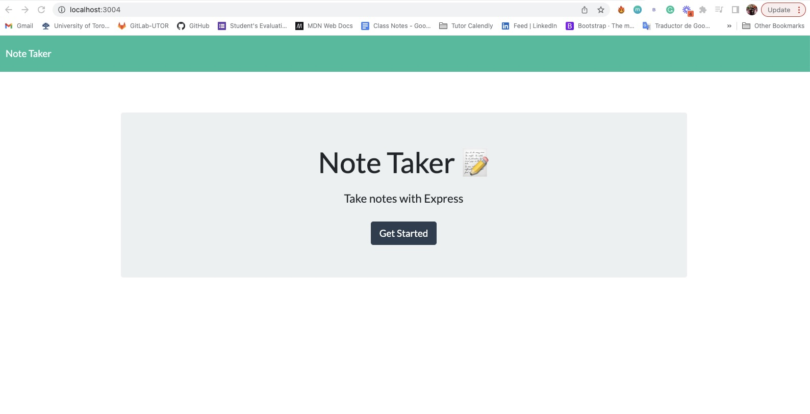
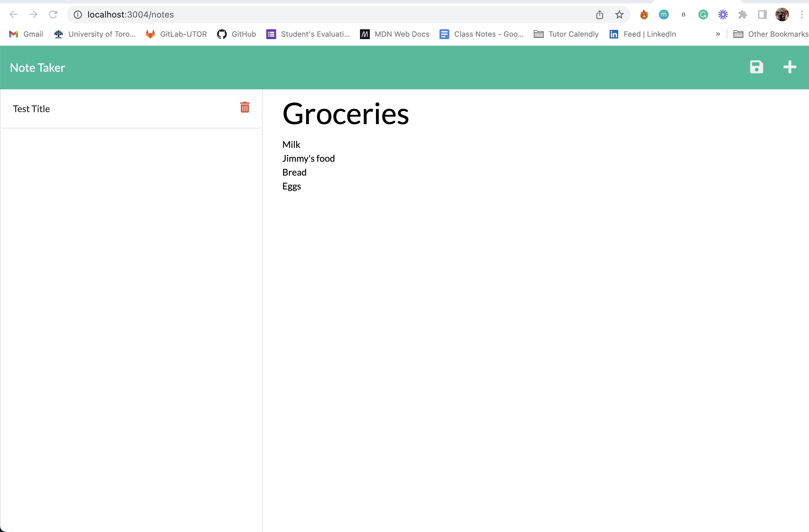

# Express.js: Note Taker

## Description

The goal of this assignment it is to modify the starter code to make the application work, it is a Note Taker that can be used to write and save notes. This application will use an Express.js back end and will save and retrieve note data from a JSON file.
On the back end, the application should include a `db.json` file that will be used to store and retrieve notes using the `fs` module.

The application’s front end has already been created. My job is build the back end, connect the two, and then deploy the entire application to Heroku.

## Mock-Up

The following images show the web application's appearance and functionality:

App deployed in Heroku, [click here](https://secret-atoll-58030.herokuapp.com/)

### Walkthrough Video:

Clicking [this link](https://loom.com/share/2222333be6de4a3398be4cd2cd3751a5) you will find the video with the demonstration of the app.